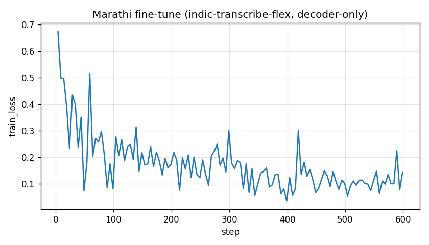

# Fine-tuning Bodhan Indic-Transcribe (ASR) on Marathi

Take-home for the AI Research Engineer role (AI4Bharat / Bodhan AI). Fine-tunes
[`bodhan-ai/indic-transcribe-flex`](https://huggingface.co/bodhan-ai/indic-transcribe-flex)
— a 1.2B NeMo ASR model (FastConformer encoder + Transformer decoder, a
`nvidia/canary-1b-v2` derivative) — on Marathi speech, end-to-end on 2× A6000.

The point of the exercise is a clean, working fine-tuning pipeline (metrics are
not graded). This README contains the complete evaluator-facing approach,
results, operational benchmark, reproduction instructions, and artifact link.

## Result
| model | WER (100 FLEURS `mr` val clips) |
|---|---|
| base `indic-transcribe-flex` | 0.180 |
| fine-tuned (decoder-only, 600 steps) | 0.165 |

train_loss 0.67 -> 0.14 over 600 steps:



## Deployment benchmark

On 100 held-out Marathi clips (1,315.62 seconds of audio) on one RTX A6000, the
fine-tuned model holds **0.1648 WER** from batch 1 through batch 8 while
throughput rises from **15.191** to **44.444 audio seconds/second**. The model
itself uses 4.602 GiB of allocated GPU memory. Each configuration transcribed
the same clips with the same 0.1648 WER.

| Batch | p50 request | p95 request | Throughput | Peak GPU memory | Recommended use |
|---:|---:|---:|---:|---:|---|
| 1 | 0.831 s | 1.408 s | 15.191 audio s/s | 4.777 GiB | Interactive/live requests |
| 2 | 1.051 s | 1.595 s | 24.301 audio s/s | 4.953 GiB | Small queues |
| 4 | 1.363 s | 1.878 s | 39.507 audio s/s | 5.304 GiB | Balanced queued workload |
| 8 | 2.157 s | 3.090 s | 44.444 audio s/s | 6.006 GiB | Offline/bulk processing |

Batch 4 is the recommended balanced configuration: it reaches 89% of batch
8's throughput while keeping p95 latency 39% lower and peak memory 0.702 GiB
lower. The benchmark warms the model before resetting memory counters and
synchronizes CUDA around each request. Raw results and console output are in
[`artifacts/benchmark.csv`](artifacts/benchmark.csv) and
[`artifacts/benchmark.log`](artifacts/benchmark.log).

## Approach and engineering judgment

### Model and data choice

I chose ASR and `bodhan-ai/indic-transcribe-flex`, Bodhan's 1.2B NeMo Canary
model. It was the most practical option for a reproducible end-to-end result:
it is smaller than the MT/TTS alternatives, has an established NeMo training
path, and Marathi FLEURS speech is a clean, ungated starting corpus. I prepared
800 training and 200 validation clips from FLEURS `mr_in`; each 16 kHz mono WAV
clip is emitted as a NeMo multitask manifest with transcript and language/prompt
fields.

### Fine-tuning strategy

The model is restored using Bodhan's shipped tokenizer registration helper, so
the custom multilingual tokenizer is handled exactly as the authors intend. I
freeze the FastConformer encoder and train the decoder plus heads by default.
For this modest dataset, that reduces catastrophic forgetting and optimizer
state while retaining the pretrained acoustic representation. Training used
AdamW, a 1e-5 learning rate with cosine warm-up, bf16 precision, and DDP across
two RTX A6000 GPUs for 600 steps. `--full` enables an all-parameter fine-tune.

### Problems diagnosed and fixed

1. This host's custom torch CUDA 12.6 build conflicted with a torchaudio CUDA
   12.8 import guard. `src/_env.py` applies a narrowly scoped version-string
   compatibility shim before NeMo imports; GPU audio operations were verified.
2. `datasets>=5` required torchcodec for ordinary audio decoding. Data prep uses
   `Audio(decode=False)` and decodes the bytes with `soundfile`, avoiding another
   torch-pinned dependency.
3. The aggregate multilingual tokenizer requires a per-utterance `lang` field;
   adding `lang: mr` to the manifests fixed tokenization.
4. Lightning attempted to wrap Lhotse's dynamic sampler in a
   `DistributedSampler`, which has no compatible length. Setting
   `use_distributed_sampler=False` lets Lhotse shard DDP data itself.

### Reproducibility and evaluation scope

A 10-step single-GPU smoke run validated data preparation, restore, training,
validation, inference, and checkpoint save before the real run. The held-out
WER change (0.180 to 0.165) and loss curve are sanity evidence, not a benchmark
claim: the assignment prioritizes a working pipeline and sound engineering
decisions. A dedicated `bodhan-asr` conda environment preserves the machine's
shared environment.

## Layout
- `src/prepare_data.py` — Marathi dataset (Google FLEURS `mr_in`) -> NeMo manifests.
- `src/finetune.py` — restore the model, freeze encoder, train decoder on 2× A6000 (DDP, bf16).
- `src/infer.py` — transcribe + WER, base vs fine-tuned.
- `src/benchmark.py` — reproducible latency, throughput, memory, and WER study
  across inference batch sizes.
- `src/_env.py` — narrowly scoped torch/torchaudio CUDA compatibility shim.
- `artifacts/` — loss curve, metrics, training/inference/benchmark logs, and
  the Drive artifact manifest.
- `PROGRESS.md` — chronological implementation log.

## Quickstart
```bash
conda create -y -n bodhan-asr python=3.10 pip && conda activate bodhan-asr
pip install -r requirements.txt
huggingface-cli login                      # accept the Bodhan license on the model page first
python src/prepare_data.py --out data/fleurs_mr
python src/finetune.py --data data/fleurs_mr --smoke               # 10-step sanity run
python src/finetune.py --data data/fleurs_mr --devices 2 --max-steps 600
python src/infer.py  --data data/fleurs_mr --finetuned outputs/indic_transcribe_mr.nemo
CUDA_VISIBLE_DEVICES=1 python src/benchmark.py --data data/fleurs_mr \
  --finetuned outputs/indic_transcribe_mr.nemo --limit 100
```

The fine-tuned checkpoint (`outputs/indic_transcribe_mr.nemo`, 4.6GB) is shared
via Google Drive rather than git:

https://drive.google.com/drive/folders/1pKZw-Aohw3LCqxQBbNURYxnGLuMVU96r?usp=sharing

The Drive folder contains the checkpoint and the artifacts listed in
[`artifacts/DRIVE_CONTENTS.md`](artifacts/DRIVE_CONTENTS.md). Checkpoint SHA-256:

```text
3cdbdc1f5aacdf739238969e7d9deace3b957e2f06774af6c8b09b0c59561731
```
